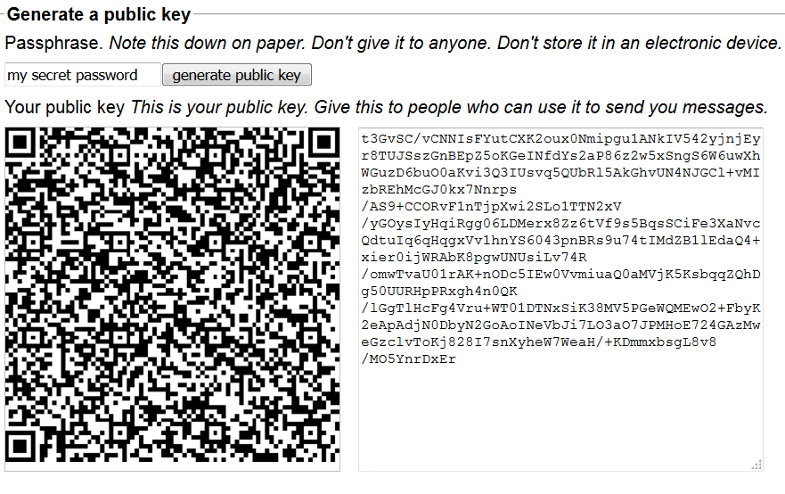
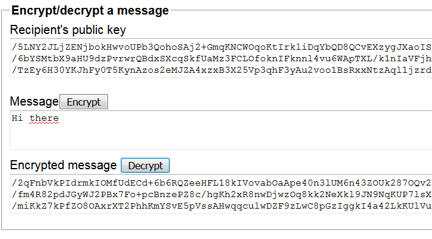

# webencryption
Simple HTML and Javascript for (offline) encrypting text with a web browser. Built with [cryptico](https://github.com/wwwtyro/cryptico).

## Changelog

__unreleased__ Link in webapp to git repository

__21.03.2018__ [sha1_dbdcff1a978eaf609c232bcbb3ed8fe0e5ba9b2f.zip](https://github.com/ggeorgovassilis/webencryption/raw/master/releases/sha1_dbdcff1a978eaf609c232bcbb3ed8fe0e5ba9b2f.zip)  
Caching private key during session; encrypting multiple messages is faster now. Updated documentation. QR code generation of public keys.

__20.03.2018__ [sha1_B61D3C98F98E1B39E83E28778690732DA8DFFD77.zip](https://github.com/ggeorgovassilis/webencryption/raw/master/releases/sha1_B61D3C98F98E1B39E83E28778690732DA8DFFD77.zip)  
Initial release. Generate public keys, encrypt and decrypt messages.

## Quickstart (not recommended for serious use)

Visit [https://ggeorgovassilis.github.io/webencryption/index.html](https://ggeorgovassilis.github.io/webencryption/index.html)

Don't use the web version for security-sensitive communication. Always download and run from a computer.

## Why?

Secure messaging is a compromise between trust, comfort and hard work. Implementations either require you to trust a messaging
provider by installing his closed-source application, using a web service whose operation you don't control or digging into the hard cryptographic stuff.

This implementation doesn't solve any of those problems, it just shifts the focus.

_Ease of operation_: download & run in the browser on any main-stream operating system.

_Trust_: the code is Javascript which you can download and run as-is, there is no compilation step which produces a binary. The code can be inspected and audited by everyone before using it. There is no
update mechanism, no network connections are being made, no devices on the hosting computer are accessed (don't take my word, rather inspect the code yourself). 

# Operating manual

## Installation

1. Get one of the releases in the [releases folder](https://github.com/ggeorgovassilis/webencryption/tree/master/releases). The file name is the SHA1 hash of the contents. Download and extract.

2. Open 'index.html' with a web browser. Allow Javascript/active content.

3. Think of a passphrase and enter it in the "passphrase" field. Click on "generate public key". This might take a while and might show slow script warnings. Let it finish.

4. Make a (preferably) offline note of the passphrase. You will need this to encrypt messages.

5. Distribute the generated public key freely. People who want to send you messages need your public key.

## Sending messages

1. Enter the public key of the recipient into the "Public key" box (in the "Encrypt message" section)
2. Enter the message to encrypt into the "Message" box
3. Click "Encrypt"
4. Send the text from "Encrypted message" to the recipient

## Receiving messages

1. Enter your passphrase into the "Passphrase" field.
2. Enter the message to decrypt into the "Encrypted message" box
3. Click "Decrypt". This will take a while. The browser might show a slow page warning, let it finish.
4. The decrypted message is shown in the "Message" box.

## Security considerations

Always download Webencryption and run it from your own device. Ideally you should run Webencryption on devices without network connectivity. I use an old Linux laptop from which I have removed the radio module and a USB key to that end.

Distribute public keys over a secure channel. I print mine out as QR codes on paper and give them to people. I give most people the same public key; some people receive unique keys.

Passphrases should be kept offline. I print them out.

# Tech stuff

Webencryption uses and copies parts of [cryptico](https://github.com/wwwtyro/cryptico). While the project seems to have been
abandoned (last update was 6 years ago at the time of this writing), it's sufficiently modular without becoming too complex
for me to understand... like [cryptojs](https://code.google.com/archive/p/crypto-js/).

The encryption algorithm is a 3072 bit RSA which is why key generation and encryption takes a while. I hear that 2048 bits aren't secure anymore.

# License

Webencryption uses cryptico's GPL 2.0, see [LICENSE](https://github.com/ggeorgovassilis/webencryption/blob/master/LICENSE)

# Credits

Webencryption wouldn't be possible without these libraries:

- [cryptico](https://github.com/wwwtyro/cryptico) by Rye Terrell
- jsaes by B. Poettering  
- [Secure hash](http://www.webtoolkit.info/) by Angel Marin, Paul Johnston  
- [QRCode.js](https://github.com/davidshimjs/qrcodejs)
- Basic JavaScript BN library by Tom Wu
- [seedrandom](http://davidbau.com/encode/seedrandom-min.js) by David Bau 

# FAQ

### How do keys work?

Think of public keys as postal addresses. You need addresses to send letters to people.

__Your own public key__: Other people need to know your public key in order to send you encrypted messages. You need the passphrase that generated the public key to read messages other people send you.
__Recipient's public key__: You need a recipient's public key to send him or her messages.  

### Where are the private keys?

They are derived from the passphrase and are not stored. This takes a bit to compute but makes things easier. Webencryption caches your private key in memory for speed (but not in a cookie or local storage or any other form).

### Why does encryption and key generation take so long?

Webcryption uses 3072 bits for keys, that takes a while to compute. You can reduce that value in
`index.html` (look for the `bits` variable), but messages will be less secure and not compatible with other Webcryption messages.

### How secure is this?

Webencryption won't be much use on a compromised computer where a virus sends screenshots home or records key strokes. Webencryption, like every programme, might contain bugs.

